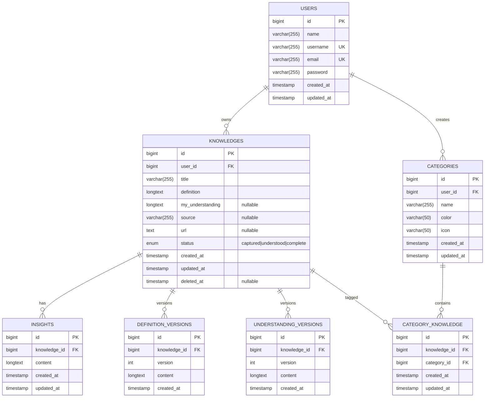

# Luma v1.0 — ERD (Entity Relationship Diagram)

> **Tagline:** Learn. Capture. Grow.
>
> **Stack:** Laravel + Inertia.js + React + MySQL
>
> **Scope:** MVP

## 1. Mermaid ERD



## 2. Entity Overview

| Entity | Purpose |
|---|---|
| `users` | Authentication, profile, and ownership boundary |
| `knowledges` | Main knowledge record |
| `categories` | User-owned custom categories |
| `category_knowledge` | Pivot table for Knowledge ↔ Category many-to-many relation |
| `insights` | User reflections attached to a Knowledge |
| `definition_versions` | History of Definition saves |
| `understanding_versions` | History of My Understanding saves |

## 3. Relationship Rules

### User → Knowledge
- One user can own many Knowledge records.
- Each Knowledge belongs to exactly one user.
- Data access must always be scoped to the authenticated user's `user_id`.

### User → Category
- One user can create many Categories.
- Each Category belongs to exactly one user.
- Category names must be unique per user.

### Knowledge ↔ Category
- Many-to-many relationship.
- Implemented through `category_knowledge`.
- One Knowledge can have zero or many Categories.
- One Category can be assigned to zero or many Knowledge records.
- A duplicate `(knowledge_id, category_id)` pair is not allowed.

### Knowledge → Insight
- One Knowledge can have zero or many Insights.
- Each Insight belongs to exactly one Knowledge.
- Creating, editing, or deleting an Insight updates the parent Knowledge `updated_at`.

### Knowledge → Definition Version
- One Knowledge has one or many Definition Versions.
- A newly created Knowledge starts with Definition Version `1`.
- Every `Save Changes` creates a new Definition Version, even when the content is unchanged.
- Version numbers are sequential per Knowledge.

### Knowledge → My Understanding Version
- One Knowledge can have zero or many Understanding Versions.
- If `my_understanding` is empty on creation, no version exists yet.
- The first saved My Understanding becomes Version `1`.
- Every later `Save Changes` creates a new version, even when the content is unchanged.

## 4. Knowledge Status Rules

Recommended state machine for MVP:

| Status | Condition |
|---|---|
| `captured` | `my_understanding` is empty |
| `understood` | `my_understanding` exists and there are zero Insights |
| `complete` | `my_understanding` exists and there is at least one Insight |

The status is system-generated and should not be directly editable by the user.

## 5. Soft Delete

`knowledges` uses Laravel soft deletes:

- Active record: `deleted_at = NULL`
- Trash: `deleted_at IS NOT NULL`
- Restore: set `deleted_at = NULL`
- Permanent delete: hard delete the record

When a Knowledge is deleted, it moves to Trash rather than being permanently removed.

## 6. Uncategorized Behavior

`Uncategorized` does **not** need its own Category row.

A Knowledge is considered `Uncategorized` when it has **zero rows** in `category_knowledge`.

This keeps Category data clean and avoids creating a system-owned category per user.

## 7. Recommended Constraints and Indexes

### `users`

- `PRIMARY KEY (id)`
- `UNIQUE (username)`
- `UNIQUE (email)`

### `knowledges`

- `PRIMARY KEY (id)`
- `INDEX (user_id)`
- `INDEX (user_id, deleted_at)`
- `INDEX (user_id, updated_at)`
- `INDEX (status)`

### `categories`

- `PRIMARY KEY (id)`
- `INDEX (user_id)`
- `UNIQUE (user_id, name)`

### `category_knowledge`

- `PRIMARY KEY (id)`
- `INDEX (knowledge_id)`
- `INDEX (category_id)`
- `UNIQUE (knowledge_id, category_id)`

### `insights`

- `PRIMARY KEY (id)`
- `INDEX (knowledge_id)`

### `definition_versions`

- `PRIMARY KEY (id)`
- `INDEX (knowledge_id)`
- `UNIQUE (knowledge_id, version)`

### `understanding_versions`

- `PRIMARY KEY (id)`
- `INDEX (knowledge_id)`
- `UNIQUE (knowledge_id, version)`

## 8. Delete / Cascade Strategy

Recommended database behavior:

- Deleting a **User** permanently should delete all owned Knowledge, Categories, and their dependent records.
- Deleting a **Knowledge** permanently should delete its Insights, Definition Versions, Understanding Versions, and pivot rows.
- Deleting a **Category** should delete only its `category_knowledge` pivot rows; Knowledge must remain.
- Restoring a Knowledge must not recreate Categories that were deleted while the Knowledge was in Trash.

Application-level authorization must be enforced in Laravel in addition to database constraints.

## 9. Query Ownership Rule

Every user-owned resource must be scoped to the authenticated user.

Example:

```php
Knowledge::query()
    ->where('user_id', auth()->id());
```

For nested resources such as Insights and Version History, authorization should be verified through the parent Knowledge owner before access is granted.

## 10. Search Scope

MVP Search operates on:

- `knowledges.title`
- `knowledges.definition`
- `knowledges.my_understanding`
- `insights.content`

Search behavior:

- Case-insensitive
- Partial match

Search does not include `source` or `url`.

## 11. Notes for Laravel Implementation

Suggested Eloquent relationships:

```php
// User
hasMany(Knowledge::class)
hasMany(Category::class)

// Knowledge
belongsTo(User::class)
belongsToMany(Category::class)
hasMany(Insight::class)
hasMany(DefinitionVersion::class)
hasMany(UnderstandingVersion::class)

// Category
belongsTo(User::class)
belongsToMany(Knowledge::class)

// Insight
belongsTo(Knowledge::class)

// DefinitionVersion
belongsTo(Knowledge::class)

// UnderstandingVersion
belongsTo(Knowledge::class)
```

## 12. Future Extension Notes

The following Post-MVP features should **not** require breaking the MVP model if possible:

- AI-generated summaries and insights
- Semantic search
- Unlisted / Share by Link
- File and image attachments
- Dark mode preferences
- Notifications / reminders

For Share by Link, the future design can add sharing metadata to `knowledges` or use a dedicated `knowledge_shares` table without changing the core Knowledge ↔ User ownership model.

---

## ERD Summary

```text
USER
 ├──< KNOWLEDGE
 │    ├──< INSIGHT
 │    ├──< DEFINITION_VERSION
 │    ├──< UNDERSTANDING_VERSION
 │    └──< >── CATEGORY (via CATEGORY_KNOWLEDGE)
 └──< CATEGORY
```
