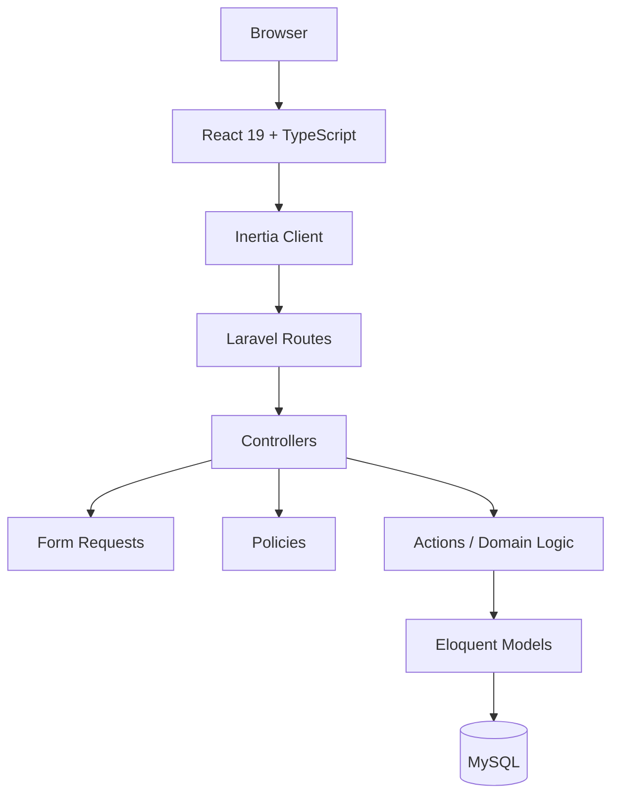
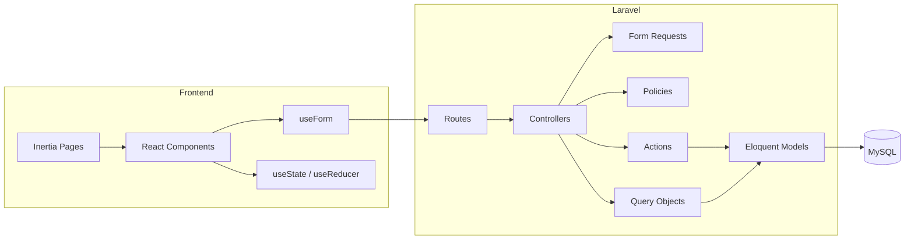

# Luma v1.0 — Technical Design Specification

> **Tagline:** Learn. Capture. Grow.  
> **Supporting statement:** Capture what you learn. Build what you know.  
> **Status:** Engineering baseline for MVP  
> **Product:** Luma Personal Knowledge Management  
> **Approach:** Laravel 13 + Inertia 3 + React 19 + TypeScript + MySQL

---

## 1. Purpose

Dokumen ini menjadi jembatan antara PRD + ERD Luma dengan implementasi aplikasi.

Fokusnya:

- system architecture
- backend boundaries
- Inertia page/data flow
- React component architecture
- validation and authorization
- business rules
- query/filtering strategy
- database transaction strategy
- testing strategy
- deployment baseline
- coding conventions

Dokumen ini **tidak** mendefinisikan visual UI secara detail karena tahap UI/UX sengaja dilewati.

---

# 2. Engineering Baseline

## 2.1 Recommended Stack

| Layer         | Technology                                  |
| ------------- | ------------------------------------------- |
| Backend       | Laravel 13                                  |
| Runtime       | PHP 8.3+                                    |
| Frontend      | React 19                                    |
| SPA bridge    | Inertia 3                                   |
| Language      | TypeScript / TSX                            |
| Styling       | Tailwind CSS 4                              |
| UI components | shadcn/ui atau custom accessible components |
| Rich text     | Tiptap                                      |
| Database      | MySQL                                       |
| Auth          | Laravel official React starter kit          |
| Asset bundler | Vite                                        |
| Tests         | Pest 4 + PHPUnit                            |
| Browser tests | Pest browser testing                        |

Laravel 13 requires PHP 8.3+, and the current official Laravel React starter kit uses React 19, TypeScript, Inertia 3, and Tailwind 4. The official starter kits supersede the older Breeze package approach for new applications.

---

# 3. Architecture Decision Records

## ADR-001 — Use Laravel Official React Starter Kit

### Decision

Untuk implementasi baru, gunakan **Laravel official React starter kit**, bukan instalasi Breeze lama.

### Reason

Requirement produk tetap sama:

- Register
- Login
- Logout
- Forgot/reset password
- Profile
- Password change
- Delete account

Yang berubah hanya bootstrap authentication implementation agar mengikuti baseline framework terbaru.

### Impact

PRD masih valid pada level product requirement.

Technical implementation baseline menjadi:

```text
Laravel 13
    +
Official React Starter Kit
    +
Inertia 3
    +
React 19
    +
TypeScript
```

---

## ADR-002 — Server-driven SPA with Inertia

Luma tidak menggunakan separate REST API untuk frontend web.

Browser:

```text
React
  │
  ▼
Inertia
  │
  ▼
Laravel Routes
  │
  ▼
Controllers
  │
  ▼
Application Logic
  │
  ▼
Eloquent / MySQL
```

Inertia menjadi transport antara server-side Laravel dan React pages.

Server tetap menjadi source of truth.

---

## ADR-003 — TypeScript for React

Walaupun product requirement menyebut React JS, implementasi frontend menggunakan **TypeScript/TSX**.

Alasan:

- type-safe page props
- lebih aman untuk form state
- lebih mudah menjaga kontrak data Inertia
- lebih mudah refactor
- lebih cocok untuk codebase yang berkembang

Tidak menggunakan Redux/Zustand pada MVP.

---

## ADR-004 — No Repository Layer by Default

Jangan membuat repository untuk setiap model.

Gunakan:

- Eloquent relationships
- local scopes
- query objects untuk query kompleks
- action/service classes untuk business operation multi-step

Repository hanya diperkenalkan bila ada kebutuhan nyata untuk mengganti persistence implementation atau abstraksi yang kompleks.

---

# 4. High-Level Architecture



---

# 5. Responsibility Boundaries

## 5.1 Laravel

Laravel bertanggung jawab untuk:

- routing
- authentication
- authorization
- validation
- business rules
- database access
- transactions
- session / flash messages
- server-side filtering
- pagination
- dashboard aggregation

## 5.2 Inertia

Inertia bertanggung jawab untuk:

- navigation tanpa full-page reload
- page props
- form submission
- server validation propagation
- partial reloads
- shared data
- deferred props

## 5.3 React

React bertanggung jawab untuk:

- rendering
- local UI state
- modals
- cards
- editor state
- responsive layout behavior
- loading states
- presentation
- client interactions

React **tidak** menjadi source of truth untuk business data.

---

# 6. Project Structure

## 6.1 Laravel

```text
app/
├── Actions/
│   ├── Categories/
│   │   ├── CreateCategory.php
│   │   ├── UpdateCategory.php
│   │   └── DeleteCategory.php
│   │
│   ├── Insights/
│   │   ├── CreateInsight.php
│   │   ├── UpdateInsight.php
│   │   └── DeleteInsight.php
│   │
│   └── Knowledges/
│       ├── CreateKnowledge.php
│       ├── UpdateKnowledge.php
│       ├── DeleteKnowledge.php
│       ├── RestoreKnowledge.php
│       ├── ForceDeleteKnowledge.php
│       └── SyncKnowledgeCategories.php
│
├── Enums/
│   └── KnowledgeStatus.php
│
├── Http/
│   ├── Controllers/
│   │   ├── DashboardController.php
│   │   ├── KnowledgeController.php
│   │   ├── InsightController.php
│   │   ├── CategoryController.php
│   │   ├── TrashController.php
│   │   └── ProfileController.php
│   │
│   ├── Requests/
│   │   ├── Knowledge/
│   │   │   ├── StoreKnowledgeRequest.php
│   │   │   └── UpdateKnowledgeRequest.php
│   │   ├── Insight/
│   │   │   ├── StoreInsightRequest.php
│   │   │   └── UpdateInsightRequest.php
│   │   ├── Category/
│   │   │   ├── StoreCategoryRequest.php
│   │   │   └── UpdateCategoryRequest.php
│   │   └── Profile/
│   │       ├── UpdateProfileRequest.php
│   │       └── DeleteAccountRequest.php
│   │
│   └── Middleware/
│       └── HandleInertiaRequests.php
│
├── Models/
│   ├── User.php
│   ├── Knowledge.php
│   ├── Category.php
│   ├── Insight.php
│   ├── DefinitionVersion.php
│   └── UnderstandingVersion.php
│
├── Policies/
│   ├── KnowledgePolicy.php
│   ├── CategoryPolicy.php
│   └── InsightPolicy.php
│
├── Queries/
│   ├── KnowledgeIndexQuery.php
│   └── DashboardQuery.php
│
└── Providers/
```

## 6.2 Frontend

```text
resources/js/
├── components/
│   ├── ui/
│   ├── app/
│   ├── knowledge/
│   ├── category/
│   ├── insight/
│   ├── history/
│   └── dashboard/
│
├── hooks/
│   ├── useDebouncedValue.ts
│   ├── useUnsavedChanges.ts
│   └── useConfirm.ts
│
├── layouts/
│   ├── app-layout.tsx
│   ├── auth-layout.tsx
│   └── guest-layout.tsx
│
├── lib/
│   ├── utils.ts
│   ├── formatting.ts
│   └── urls.ts
│
├── pages/
│   ├── Dashboard/
│   │   └── Index.tsx
│   ├── Knowledge/
│   │   ├── Index.tsx
│   │   └── Show.tsx
│   ├── Categories/
│   │   └── Index.tsx
│   ├── Trash/
│   │   └── Index.tsx
│   ├── Profile/
│   │   └── Index.tsx
│   └── Welcome.tsx
│
└── types/
    ├── index.d.ts
    ├── knowledge.ts
    ├── category.ts
    ├── insight.ts
    └── pagination.ts
```

---

# 7. Routing Convention

Gunakan named routes dan route helper sebagai sumber URL.

Jangan hard-code URL string berulang di React.

Contoh:

```php
Route::middleware('auth')->group(function () {
    Route::get('/dashboard', [DashboardController::class, 'index'])
        ->name('dashboard');

    Route::resource('knowledge', KnowledgeController::class)
        ->only(['index', 'store', 'show', 'update', 'destroy']);

    Route::post('/knowledge/{knowledge}/restore', [TrashController::class, 'restore'])
        ->name('knowledge.restore');

    Route::delete('/knowledge/{knowledge}/force', [TrashController::class, 'forceDelete'])
        ->name('knowledge.force-delete');

    Route::resource('categories', CategoryController::class)
        ->except(['show']);

    Route::resource('insights', InsightController::class)
        ->only(['store', 'update', 'destroy']);
});
```

Untuk version history:

```php
Route::get(
    '/knowledge/{knowledge}/definition-history',
    [KnowledgeController::class, 'definitionHistory']
)->name('knowledge.definition-history');

Route::get(
    '/knowledge/{knowledge}/understanding-history',
    [KnowledgeController::class, 'understandingHistory']
)->name('knowledge.understanding-history');
```

---

# 8. Controller Rules

Controller harus tipis.

Controller bertugas:

1. Receive request.
2. Authorize.
3. Delegate business operation.
4. Return Inertia response / redirect.

Controller tidak boleh berisi business logic panjang.

Bad:

```php
public function update(Request $request, Knowledge $knowledge)
{
    // 100+ lines of validation,
    // version creation,
    // status calculation,
    // category sync,
    // database operations...
}
```

Preferred:

```php
public function update(
    UpdateKnowledgeRequest $request,
    Knowledge $knowledge,
    UpdateKnowledge $action
) {
    $this->authorize('update', $knowledge);

    $action->handle($knowledge, $request->validated());

    return to_route('knowledge.show', $knowledge)
        ->with('success', 'Knowledge updated successfully.');
}
```

---

# 9. Form Requests

Gunakan Form Request untuk validation dan request-level authorization.

Contoh:

```php
class StoreKnowledgeRequest extends FormRequest
{
    public function authorize(): bool
    {
        return $this->user() !== null;
    }

    public function rules(): array
    {
        return [
            'title' => ['required', 'string'],
            'definition' => ['required', 'string'],
            'my_understanding' => ['nullable', 'string'],
            'category_ids' => ['array'],
            'category_ids.*' => ['integer'],
            'source' => ['nullable', 'string'],
            'url' => ['nullable', 'string'],
        ];
    }
}
```

Field length tidak dibatasi pada application requirement.

Database type tetap harus cukup besar.

---

# 10. Authorization

Authorization harus dilakukan server-side.

Primary rule:

```text
Authenticated User
        │
        ▼
Resource belongs to user?
        │
   ┌────┴────┐
  YES        NO
   │          │
 Allow       Deny
```

## Policies

### KnowledgePolicy

- view
- update
- delete
- restore
- forceDelete

### CategoryPolicy

- view
- update
- delete

### InsightPolicy

- view
- update
- delete

Version history tidak perlu policy terpisah bila akses selalu melalui Knowledge yang sudah di-authorize.

---

# 11. User Data Isolation

Semua query resource user harus user-scoped.

Preferred:

```php
$knowledge = $request->user()
    ->knowledges()
    ->withTrashed()
    ->findOrFail($id);
```

Jangan mengandalkan ID yang dikirim frontend sebagai bukti ownership.

Gunakan Policy untuk defense in depth.

---

# 12. Eloquent Models

## Knowledge

```php
class Knowledge extends Model
{
    use SoftDeletes;

    protected function casts(): array
    {
        return [
            'status' => KnowledgeStatus::class,
            'deleted_at' => 'datetime',
        ];
    }

    public function user(): BelongsTo
    {
        return $this->belongsTo(User::class);
    }

    public function categories(): BelongsToMany
    {
        return $this->belongsToMany(Category::class)
            ->withTimestamps();
    }

    public function insights(): HasMany
    {
        return $this->hasMany(Insight::class);
    }

    public function definitionVersions(): HasMany
    {
        return $this->hasMany(DefinitionVersion::class);
    }

    public function understandingVersions(): HasMany
    {
        return $this->hasMany(UnderstandingVersion::class);
    }
}
```

---

# 13. Knowledge Status

Gunakan PHP backed enum:

```php
enum KnowledgeStatus: string
{
    case CAPTURED = 'captured';
    case UNDERSTOOD = 'understood';
    case COMPLETE = 'complete';
}
```

Status tidak boleh di-update langsung dari frontend.

Gunakan domain logic:

```text
my_understanding empty
    -> CAPTURED

my_understanding present
    + 0 insights
    -> UNDERSTOOD

my_understanding present
    + >= 1 insight
    -> COMPLETE
```

Status harus direcalculate setelah:

- create knowledge
- update knowledge
- create insight
- update insight
- delete insight

---

# 14. Business Actions

Gunakan action class untuk operasi yang memiliki lebih dari satu side effect.

## CreateKnowledge

Responsibilities:

1. create Knowledge
2. determine initial status
3. create Definition Version 1
4. create My Understanding Version 1 if initial value exists
5. sync categories
6. commit transaction

## UpdateKnowledge

Responsibilities:

1. validate input via Form Request
2. update main record
3. always create new Definition Version
4. create new Understanding Version if My Understanding exists
5. sync categories
6. recalculate status
7. update timestamps
8. commit transaction

### Important Version Rule

Mengikuti keputusan product:

- setiap `Save Changes` membuat Definition version baru walaupun content tidak berubah
- jika My Understanding sudah pernah tersedia, setiap `Save Changes` juga membuat version baru
- jika My Understanding masih null, tidak ada version yang dibuat

---

# 15. Transactions

Gunakan database transaction untuk operasi multi-step.

Contoh:

```php
DB::transaction(function () use ($knowledge, $data) {
    $knowledge->update($data);

    $this->createDefinitionVersion($knowledge);
    $this->createUnderstandingVersionIfPresent($knowledge);

    $knowledge->categories()->sync($data['category_ids'] ?? []);

    $this->recalculateStatus($knowledge);
});
```

Transaction wajib untuk:

- create knowledge
- update knowledge
- delete/force delete workflows yang memerlukan banyak dependent operation
- category changes yang memiliki side effects
- account deletion

---

# 16. Category Design

Category:

```text
User
  │
  └──< Category
```

Constraint:

```text
UNIQUE(user_id, name)
```

Create/Edit:

- validate ownership
- validate uniqueness within user
- store name/color/icon

Delete category:

```text
Category deleted
      │
      └── Pivot rows removed
              │
              └── Knowledge remains
```

Do not delete Knowledge when Category is deleted.

---

# 17. Knowledge ↔ Category Sync

Use Laravel many-to-many synchronization:

```php
$knowledge->categories()->sync($categoryIds);
```

Before sync:

- authorize Category ownership
- reject Category IDs belonging to another user

Preferred validation:

```php
'category_ids.*' => [
    'integer',
    Rule::exists('categories', 'id')
        ->where(fn ($query) =>
            $query->where('user_id', auth()->id())
        ),
],
```

---

# 18. Uncategorized

Do not create an actual `Uncategorized` category row.

Definition:

```text
No rows in category_knowledge
        =
Uncategorized
```

This avoids special-case category ownership and simplifies filtering.

---

# 19. Search Architecture

Search fields:

- `knowledges.title`
- `knowledges.definition`
- `knowledges.my_understanding`
- `insights.content`

Behavior:

- case-insensitive
- partial match

For MVP use MySQL `LIKE` / `orWhereLike` style queries.

Do not introduce a search engine for MVP.

Possible future:

- Laravel Scout
- full text search
- semantic/vector search

---

# 20. Knowledge Index Query

Create a dedicated query object:

```php
final class KnowledgeIndexQuery
{
    public function handle(
        User $user,
        array $filters
    ): LengthAwarePaginator {
        // build user-scoped query
    }
}
```

Supported filters:

```text
search
category_ids[]
sort
per_page
page
```

Allowed sorting:

```text
recently_updated
newest
oldest
```

Never pass raw user input directly to `orderBy`.

Use an allow-list:

```php
$sortMap = [
    'recently_updated' => 'updated_at',
    'newest' => 'created_at',
    'oldest' => 'created_at',
];
```

And map direction separately.

---

# 21. Category OR Filtering

Selected categories must use OR semantics.

Conceptually:

```text
selected = [Programming, AI]

result if:
    has Programming
 OR has AI
```

With Uncategorized:

```text
selected = [Programming, AI, Uncategorized]

result if:
    has Programming
 OR has AI
 OR has no categories
```

Implement using grouped query conditions so OR logic cannot accidentally escape the user scope.

---

# 22. Pagination

Server-side pagination:

```text
10
20
50
```

Default:

```text
20
```

Store the current pagination state in query string:

```text
?per_page=20&page=2
```

Benefits:

- refreshable URL
- browser history support
- shareable internal state
- server-owned pagination

---

# 23. Search UX Strategy

The product requires:

- automatic search while typing
- Search button

Technical behavior:

```text
User types
   ↓
300ms debounce
   ↓
Inertia GET
   ↓
same page component
   ↓
partial reload
```

When filter/search changes:

- preserve scroll where appropriate
- preserve local UI state
- update URL query parameters
- reload only the data required for the current list

Avoid fetching the full page props for every keystroke.

---

# 24. Inertia Partial Reloads

Use partial reloads for Knowledge filters/search.

Concept:

```text
GET /knowledge?search=machine
      |
      +--- only: knowledge
```

Static props such as category options should not be re-fetched unnecessarily.

Use lazy/deferred props for expensive Dashboard data.

---

# 25. Shared Inertia Data

Keep global shared data minimal.

Recommended shared data:

```text
auth.user
flash.success
flash.error
app.name
```

Do not put large lists in shared props.

Example:

```php
return [
    'auth.user' => fn () =>
        $request->user()?->only([
            'id',
            'name',
            'username',
            'email',
        ]),

    'flash' => [
        'success' => fn () => $request->session()->get('success'),
        'error' => fn () => $request->session()->get('error'),
    ],
];
```

---

# 26. Inertia Forms

Use Inertia `useForm()` for normal application forms.

Do not build a custom global fetch/axios form abstraction for MVP.

Example:

```tsx
const form = useForm({
    title: '',
    definition: '',
    my_understanding: '',
    category_ids: [],
    source: '',
    url: '',
});

const submit = (event: FormEvent) => {
    event.preventDefault();

    form.post(route('knowledge.store'));
};
```

Use:

- `form.processing`
- `form.errors`
- `form.isDirty`
- `form.reset()`
- `form.clearErrors()`

This directly supports Luma's:

- field validation
- loading state
- unsaved changes
- Save/Cancel behavior

---

# 27. Unsaved Changes

Quick Edit uses:

```text
form.isDirty === true
```

When navigating away:

```text
isDirty?
  ├─ no  -> continue
  └─ yes -> confirmation
              ├─ Stay
              └─ Leave
```

Close Quick Capture remains consistent with product requirement:

- close immediately
- discard input
- no draft

---

# 28. Quick Capture Architecture

Quick Capture is a UI mode over the same Knowledge create endpoint.

It does **not** need a separate backend resource.

```text
Header
  ↓
Quick Capture Modal
  ↓
useForm()
  ↓
POST /knowledge
  ↓
KnowledgeController@store
  ↓
CreateKnowledge action
```

After success:

```text
POST success
   ↓
redirect knowledge.index
   ↓
flash.success
```

---

# 29. Rich Text Strategy

Tiptap fields:

- Definition
- My Understanding
- Insight

Recommended storage:

```text
sanitized HTML
```

Database type:

```text
LONGTEXT
```

Flow:

```text
Tiptap
  ↓
HTML
  ↓
server-side sanitizer
  ↓
database
```

When rendering:

```text
stored sanitized HTML
      ↓
safe HTML renderer
```

Do not trust raw HTML from the browser.

Allowed HTML should be restricted to the MVP toolbar:

- `<strong>`
- `<em>`
- `<ul>`
- `<ol>`
- `<li>`
- `<a>`
- required paragraph/line-break elements

---

# 30. URL Security

Product requirement says:

> No URL format validation on save.

Keep that product behavior.

However, when rendering a URL:

- store it as text
- only generate clickable `href` for safe protocols
- allow `http:` and `https:`
- otherwise render as plain text

For external links:

```html
target="_blank" rel="noopener noreferrer"
```

This preserves the product decision without opening a protocol-based XSS path.

---

# 31. Insight Architecture

Insight endpoints:

```text
POST   /insights
PUT    /insights/{insight}
DELETE /insights/{insight}
```

Every operation:

1. authorize Insight
2. validate content
3. persist
4. recalculate Knowledge status
5. touch Knowledge `updated_at`
6. flash success

Delete Insight:

- no confirmation on frontend
- backend still authorizes and validates ownership

---

# 32. Version History Architecture

Definition:

```text
Create Knowledge
    -> version 1

Every Save Changes
    -> version + 1
```

My Understanding:

```text
created empty
    -> no version

first non-null save
    -> version 1

every following Save Changes
    -> version + 1
```

Version tables:

```text
definition_versions
-------------------
id
knowledge_id
version
content
created_at

understanding_versions
----------------------
id
knowledge_id
version
content
created_at
```

Enforce:

```text
UNIQUE(knowledge_id, version)
```

---

# 33. Trash Architecture

Knowledge uses Laravel SoftDeletes.

Active list:

```php
Knowledge::query()
    ->whereNull('deleted_at')
```

Trash:

```php
Knowledge::onlyTrashed()
```

Restore:

```php
$knowledge->restore();
```

Permanent delete:

```php
$knowledge->forceDelete();
```

Authorization must be applied to every trash operation.

---

# 34. Delete Strategy

## Delete to Trash

```text
user clicks Delete
    ↓
confirmation
    ↓
DELETE /knowledge/{id}
    ↓
soft delete
    ↓
flash.success
```

## Restore

```text
POST /knowledge/{id}/restore
    ↓
restore()
```

## Permanent Delete

```text
DELETE /knowledge/{id}/force
    ↓
forceDelete()
    ↓
dependent records removed
```

---

# 35. Dashboard Query Architecture

Dashboard data should be aggregate queries, not loading every Knowledge record into PHP.

Metrics:

### Progress

```text
COUNT(*) total
COUNT(*) where status = captured
COUNT(*) where status = understood
COUNT(*) where status = complete
```

### Growth

30-day data:

```text
created per day
cumulative total
```

### Recent Knowledge

```text
ORDER BY created_at DESC
LIMIT 5
```

### Recent Insight

```text
ORDER BY created_at DESC
LIMIT 5
```

### Top Categories

Count active/non-trashed Knowledge per Category.

Use:

```text
COUNT(DISTINCT knowledge_id)
```

through the pivot relation.

---

# 36. Dashboard Deferred Data

Potentially slower sections:

- 30-day growth
- top categories

can be returned as deferred/lazy props when appropriate.

Initial response should prioritize:

- page shell
- progress metrics
- recent knowledge
- recent insights

Then load secondary dashboard blocks.

---

# 37. React Component Rules

Follow React rules:

- components must be pure
- props are immutable
- state is updated through setters/reducers
- hooks only at top level
- side effects stay in effects/event handlers

Enable React Strict Mode during development.

Avoid:

- mutating props
- mutating arrays/objects in place
- calling component functions directly
- excessive `useEffect`
- global state for server-owned data

---

# 38. State Management Strategy

## Server State

Managed by:

**Laravel + Inertia**

Examples:

- Knowledge list
- Categories
- Dashboard data
- Current user
- Server validation errors

## Form State

Managed by:

**Inertia `useForm()`**

## Local UI State

Use:

- `useState`
- `useReducer`

Examples:

- modal open/close
- active tab
- expanded section
- selected history version

## Global State

No global client store for MVP.

Introduce one only if a real cross-page client-state requirement emerges.

---

# 39. React Component Design

Prefer domain components.

Example:

```text
KnowledgeCard
├── KnowledgeStatus
├── CategoryChips
├── DefinitionSnippet
└── KnowledgeCardActions
```

And:

```text
KnowledgeForm
├── TextField
├── RichTextEditor
├── CategorySelector
├── SourceField
├── UrlField
└── FormActions
```

Avoid one giant page component.

---

# 40. Component Layering

```text
UI Components
    ↓
Domain Components
    ↓
Page Components
    ↓
Inertia Page Props
```

Example:

```text
Button
  ↓
KnowledgeCard
  ↓
Knowledge/Index.tsx
  ↓
Inertia props from Laravel
```

---

# 41. Types

Define domain types centrally.

Example:

```ts
export type KnowledgeStatus = 'captured' | 'understood' | 'complete';

export interface Knowledge {
    id: number;
    title: string;
    definition: string;
    my_understanding: string | null;
    source: string | null;
    url: string | null;
    status: KnowledgeStatus;
    created_at: string;
    updated_at: string;
    categories: Category[];
}
```

Prefer generated/shared types later if the project adopts a type-generation solution.

For MVP, keep contracts explicit and close to the domain.

---

# 42. Error Handling

## Validation

Server-side validation is authoritative.

React:

```text
form.errors.field
```

Display errors next to fields.

## Unexpected errors

Backend:

- log technical detail
- return friendly flash/toast message

Frontend:

```text
Something went wrong. Please try again.
```

Never expose:

- SQL errors
- stack traces
- internal paths
- database details

---

# 43. Toast Architecture

Laravel sends flash state through Inertia shared data.

Example:

```php
return to_route('knowledge.index')
    ->with('success', 'Knowledge created successfully.');
```

React App Layout listens to shared flash props and renders a toast.

No global client state library required.

---

# 44. Loading State

## Forms

Use Inertia form state:

```text
form.processing
```

Button labels:

```text
Save
Saving...
Delete
Deleting...
Restore
Restoring...
```

## Pages

Use skeleton components.

Avoid full-screen global spinners for normal navigation.

---

# 45. Accessibility

Every interactive element must have:

- accessible name
- visible focus state
- keyboard interaction
- semantic element where possible
- proper form label

Modals must:

- trap focus
- close according to product rules
- restore focus to triggering element when appropriate

Bottom navigation must remain keyboard accessible on mobile-sized layouts.

---

# 46. Performance Rules

## Backend

- eager load required relations
- prevent N+1 queries
- paginate Knowledge
- paginate history
- aggregate Dashboard in SQL
- never `Model::all()` for large collections

Example:

```php
Knowledge::query()
    ->with(['categories:id,name,color,icon'])
    ->latest('updated_at')
    ->paginate($perPage);
```

## Frontend

- split pages automatically through Inertia/Vite
- avoid unnecessary context/global state
- use memoization only when profiling justifies it
- avoid rendering very large lists at once

---

# 47. Query Safety

All dynamic query parameters must use allow-lists.

Example:

```text
sort:
    recently_updated
    newest
    oldest

per_page:
    10
    20
    50
```

Reject or normalize unsupported values.

Never concatenate raw `sort` values into SQL.

---

# 48. Database Integrity

Required foreign key behavior:

```text
users -> knowledges
users -> categories

knowledges -> insights
knowledges -> definition_versions
knowledges -> understanding_versions

knowledges <-> categories
```

Recommended:

- cascade pivot rows
- cascade dependent versions/insights on permanent Knowledge deletion
- category deletion removes pivot only
- knowledge remains
- user deletion removes owned records

---

# 49. Database Indexing

Required:

```text
users
    UNIQUE(username)
    UNIQUE(email)

knowledges
    INDEX(user_id)
    INDEX(user_id, deleted_at)
    INDEX(user_id, updated_at)

categories
    UNIQUE(user_id, name)
    INDEX(user_id)

category_knowledge
    UNIQUE(knowledge_id, category_id)
    INDEX(category_id)
    INDEX(knowledge_id)

insights
    INDEX(knowledge_id)

definition_versions
    UNIQUE(knowledge_id, version)

understanding_versions
    UNIQUE(knowledge_id, version)
```

---

# 50. Testing Strategy

Testing should prioritize business behavior over implementation details.

## 50.1 Feature Tests

Primary:

- authentication
- authorization
- create Knowledge
- update Knowledge
- trash
- restore
- force delete
- category CRUD
- category ownership
- category OR filter
- Uncategorized filter
- search
- pagination
- Insight CRUD
- version history
- Dashboard aggregates
- Delete Account

## 50.2 Unit Tests

Good candidates:

- Knowledge status resolver
- version numbering logic
- query filter normalization
- URL safety helper
- content sanitizer policy

## 50.3 Browser Tests

Critical end-to-end journeys:

```text
Register
  -> Login
  -> Quick Capture
  -> Edit
  -> Add Insight
  -> Complete

Search
  -> Filter Category
  -> Open Detail

Delete
  -> Trash
  -> Restore

Delete Account
  -> password confirmation
  -> account removed
```

For new Laravel projects, Pest 4 browser testing is preferred over introducing Laravel Dusk unless a specific browser-testing need requires Dusk.

---

# 51. Testing Data Strategy

Use:

- model factories
- seeders for local/demo data
- RefreshDatabase for database tests

Factories required:

```text
UserFactory
KnowledgeFactory
CategoryFactory
InsightFactory
DefinitionVersionFactory
UnderstandingVersionFactory
```

---

# 52. Security Checklist

Before MVP release:

- [ ] All authenticated routes use auth middleware.
- [ ] Every resource is user-scoped.
- [ ] Policies cover CRUD + restore + force delete.
- [ ] Form Requests validate all mutations.
- [ ] Mass assignment is controlled.
- [ ] Rich text is sanitized.
- [ ] Unsafe URL schemes are not rendered as clickable links.
- [ ] Password is never returned in Inertia props.
- [ ] SQL errors are not exposed.
- [ ] Production APP_DEBUG is false.
- [ ] CSRF protection remains enabled.
- [ ] Production uses HTTPS.
- [ ] Session/cookie configuration is secure.

---

# 53. Environment Configuration

Example:

```env
APP_NAME=Luma
APP_ENV=local
APP_KEY=
APP_DEBUG=true
APP_URL=http://luma.test

DB_CONNECTION=mysql
DB_HOST=127.0.0.1
DB_PORT=3306
DB_DATABASE=luma
DB_USERNAME=
DB_PASSWORD=
```

Never commit `.env`.

Use `.env.example` as the configuration contract.

---

# 54. Local Development

Recommended flow:

```bash
composer install
npm install

php artisan migrate
npm run dev
```

For a containerized team environment, Laravel Sail can be introduced without changing the application architecture.

---

# 55. Production Baseline

Production requirements:

```text
PHP >= 8.3
MySQL
Nginx or FrankenPHP
Node build environment for CI
HTTPS
```

Build:

```bash
npm run build
php artisan optimize
```

Use production-safe configuration:

```env
APP_ENV=production
APP_DEBUG=false
```

Do not expose application root outside the web server's public document root.

---

# 56. Logging and Monitoring

Application logs must contain:

- unexpected exceptions
- failed actions
- authorization failures where useful
- critical database errors

Do not log:

- raw passwords
- sensitive authentication tokens
- full request bodies containing credentials

---

# 57. Development Conventions

## PHP

- PSR-12
- strict typing where practical
- explicit return types
- backed enums for domain states
- Form Requests for complex validation
- Policies for authorization
- Transactions for multi-write operations

## React / TypeScript

- functional components
- TypeScript interfaces/types
- no implicit `any`
- hooks only at top level
- pure render logic
- domain-oriented components
- avoid premature memoization

## Naming

Backend:

```text
KnowledgeController
StoreKnowledgeRequest
UpdateKnowledge
KnowledgePolicy
```

Frontend:

```text
KnowledgeCard
KnowledgeForm
CategorySelector
InsightItem
```

---

# 58. API vs Inertia Contract

Luma MVP web frontend does not expose a public REST API.

Use:

```text
Laravel routes
+
Inertia page responses
+
Inertia form submissions
```

Do not create:

```text
/api/v1/...
```

for internal web features unless a genuine consumer appears later.

Post-MVP mobile application or external integrations may justify introducing a versioned API.

---

# 59. Suggested Implementation Sequence

## Phase 1 — Bootstrap

1. Create Laravel 13 app.
2. Install official React starter kit.
3. Configure MySQL.
4. Configure Vite.
5. Configure Tailwind.
6. Verify authentication.
7. Add TypeScript conventions.

## Phase 2 — Database

1. Migrations.
2. Enums.
3. Foreign keys.
4. indexes.
5. Models.
6. Relationships.
7. factories.

## Phase 3 — Authorization

1. policies
2. user scoping
3. account deletion
4. trash authorization

## Phase 4 — Knowledge Domain

1. CreateKnowledge
2. UpdateKnowledge
3. DeleteKnowledge
4. RestoreKnowledge
5. ForceDeleteKnowledge
6. status resolver
7. versioning

## Phase 5 — Categories

1. category CRUD
2. pivot sync
3. category selector
4. OR filtering
5. Uncategorized

## Phase 6 — Insights

1. create
2. edit
3. delete
4. status recalculation

## Phase 7 — Search/List

1. index query
2. filters
3. sorting
4. search
5. pagination
6. partial reload

## Phase 8 — Dashboard

1. metrics
2. 30-day growth
3. recent knowledge
4. recent insights
5. top categories

## Phase 9 — UX Infrastructure

1. toast
2. skeleton
3. error states
4. unsaved-change confirmation
5. responsive navigation

## Phase 10 — Testing

1. feature tests
2. unit tests
3. browser tests
4. regression suite

---

# 60. Definition of Done

A feature is considered complete only when:

- PRD behavior is implemented.
- Authorization exists.
- Validation exists.
- Database constraints exist.
- Loading state exists.
- Success feedback exists.
- Error feedback exists.
- Relevant tests pass.
- No N+1 query exists on the primary path.
- Responsive behavior works.
- No console/runtime errors are introduced.
- Code follows project conventions.

---

# 61. Final Architecture



---

# 62. Engineering Principle

Luma mengikuti prinsip:

> **Server owns business truth. React owns presentation state. Inertia connects them.**

Secara praktis:

```text
Business rule?
    -> Laravel

Authorization?
    -> Laravel Policy

Validation?
    -> Laravel Form Request

Persistent data?
    -> Eloquent / MySQL

Navigation?
    -> Inertia

Form state?
    -> Inertia useForm

Modal / local UI?
    -> React state

Reusable presentation?
    -> React components
```

Ini menjaga codebase tetap sederhana tanpa berubah menjadi SPA + REST API + duplicate state architecture yang belum dibutuhkan oleh MVP.
